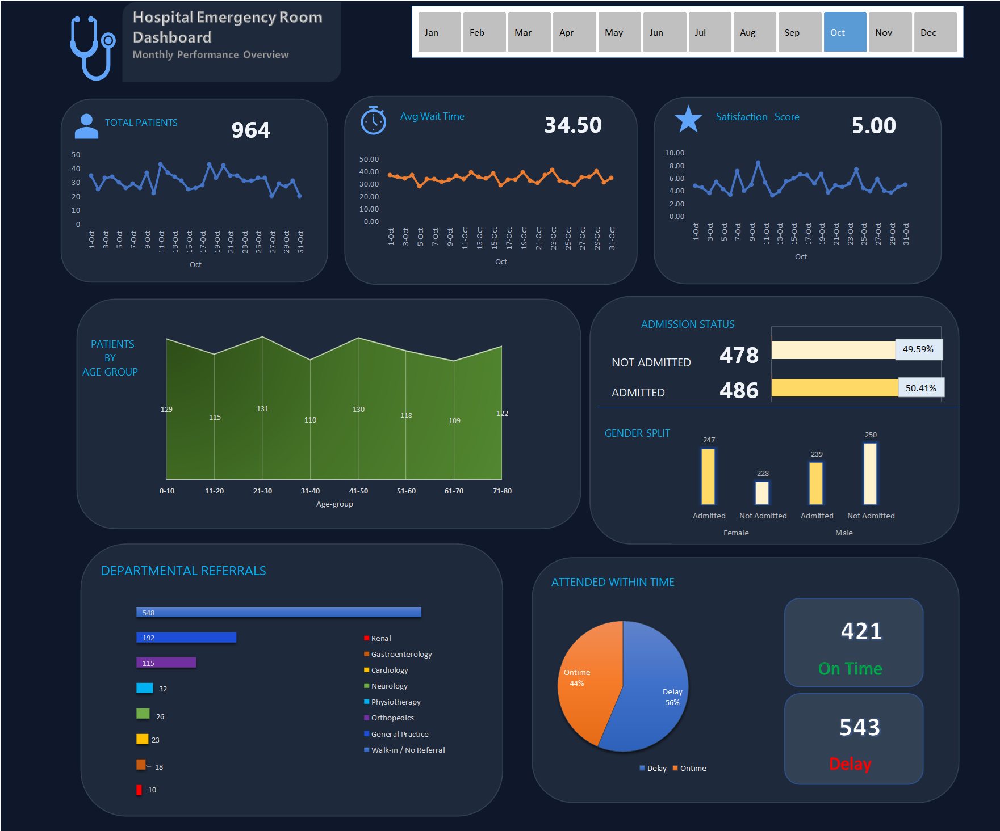

# 🏥 Hospital Emergency Room — Data Analysis Dashboard

<div align="center">

**An end-to-end Excel analytics project on 9,216 hospital emergency room patient records**  
*Power Query · Power Pivot · DAX · Calendar Table · Interactive Dashboard*

</div>

---

## 📸 Dashboard Preview



> *Built entirely in Microsoft Excel using Power Query for ETL, Power Pivot for data modeling, and Pivot Charts for visualization.*

---

## 📌 Project Summary

This project analyzes **9,216 Emergency Room patient records** from a hospital system spanning **January 2024 – September 2024**. It covers the complete data analytics pipeline — from raw messy CSV data to a fully interactive Excel dashboard — uncovering operational bottlenecks and patient experience gaps.

| | |
|---|---|
| 📅 **Period Covered** | January 2024 – September 2024 |
| 👥 **Total Records** | 9,216 patients |
| 🔧 **Primary Tool** | Microsoft Excel (Power Query + Power Pivot) |
| 🎯 **Goal** | Identify ER inefficiencies and recommend data-driven improvements |

---

## 🛠️ Tools & Techniques Used

| Area | What I Did |
|---|---|
| **Power Query** | Data cleaning, transformation, column standardization, type fixing |
| **Power Pivot** | Data modeling, table relationships, DAX calculated columns |
| **DAX Formulas** | Age Group, Wait Bucket, Attend Status, time dimension columns |
| **Calendar Table** | Created from scratch for full time intelligence (Year/Quarter/Month) |
| **Pivot Tables** | KPI aggregation, monthly trends, department breakdowns |
| **Excel Dashboard** | Interactive visuals with slicers and charts |

---

## 🔄 What I Built — Step by Step

```
Raw CSV  →  Power Query (Clean)  →  Power Pivot (Model)  →  DAX (Enrich)  →  Pivots  →  Dashboard
```

### 1. 🧹 Data Cleaning in Power Query
- Standardized `Gender` — merged inconsistent entries (`"Male"` / `"M"`, `"Female"` / `"F"`)
- Split `Admission Date` into separate **Date** and **Time** columns
- Merged first initial + last name into a clean `Patient Full Name` column
- Removed the duplicate `Patient Admission Flag.1` column
- Fixed all data types — dates, integers, booleans, and text
- Handled null values in `Satisfaction Score` (73% of records had no score)

### 2. 📐 Data Modeling in Power Pivot
- Built a **Calendar Table** using DAX linked to the fact table on Admission Date
- Created relationships between tables for clean time-based analysis
- Added **4 calculated columns via DAX:**
  - `Age Group` — grouped patient ages into 8 bands (0–10, 11–20 … 71–80)
  - `Wait Bucket` — categorized wait times (0–15, 16–30, 31–45, 46–60 min)
  - `Patient Attend Status` — flagged each visit as `Ontime` or `Delay`
  - `Year`, `Quarter`, `Month Index`, `Month` — time dimension columns

### 3. 📊 Analysis & Dashboard
- Built pivot tables for: KPI summary, monthly trends, department referrals, age groups, satisfaction, wait time distribution
- Designed an interactive dashboard with slicers for dynamic filtering
- Wrote a full **Insights & Recommendations Report** inside the workbook

---

## 📊 Key Findings

> ⚠️ *Full findings with evidence and pivot table sources are documented in the **"Insights and Recommendation"** sheet inside the Excel file.*

| # | Finding | Data |
|---|---|---|
| ⏱️ | **59.3% of patients were delayed** — not seen within target time | 5,467 of 9,216 waited beyond threshold |
| 🏥 | **50% admission rate** — nearly double the global ER benchmark of 15–25% | Suggests over-admission or high-acuity intake |
| 📋 | **58.6% of patients arrived with no referral** (walk-ins) | 5,400 self-referred vs 3,816 referred |
| ⭐ | **Average satisfaction is 5.0/10** — neutral, with 73% not responding | Only 2,517 of 9,216 patients gave a score |
| 📅 | **August is the busiest month** (1,024 visits vs 431 in February) | Clear summer surge pattern |
| 👥 | **All age groups visit equally** — no single group dominates | Range of only 11.4%–13.1% per band |

---

## 💡 Recommendations

| Priority | Action | Expected Outcome |
|---|---|---|
| 🔴 High | Tackle the 59.3% delay rate — fast-track low-acuity cases | Raise on-time rate toward the 70%+ benchmark |
| 🔴 High | Audit the high 50% admission rate against the 15–25% norm | Free beds, reduce costs, improve ER flow |
| 🟠 Medium | Make satisfaction surveys mandatory at discharge | Turn a 73%-null metric into a usable KPI |
| 🟠 Medium | Redirect walk-in cases to GP / primary care clinics | Reduce ER load; reserve capacity for emergencies |
| 🟡 Review | Pre-plan summer staffing using monthly pivot forecasts | Prevent August surge from causing burnout and delays |
| 🟡 Review | Train staff across all age groups (paediatric to elderly) | No skill gaps when patient mix shifts |

---

## 📁 Repository Structure

```
Hospital-Emergency-Room-Analysis/
│
├── Hospital_Emergency_room.xlsx         ← Main project file
│   ├── 📊 Dashboard                     ← Interactive visual dashboard
│   ├── 📝 Insights and Recommendation   ← Full written analysis report
│   ├── 📈 Monthly_Insight_Pivot         ← Month-on-month trend analysis
│   ├── 🔢 Pivot_for_Dashboard           ← KPI pivot tables (backend)
│   └── 🧹 Cleaned_Data                  ← Power Query output (18 columns)
│
├── Hospital_Emergency_Room_Data.csv     ← Original raw dataset
├── Dashboard_Screenshot.png            ← Dashboard preview
└── README.md                           ← This file
```

---

## 🎓 Skills Demonstrated

- **ETL Pipeline** — Raw CSV → clean, enriched, analysis-ready dataset
- **Power Query** — Real-world messy data cleaning and standardization
- **Power Pivot + DAX** — Data modeling, relationships, and custom measures
- **Time Intelligence** — Calendar table + Quarter/Month drill-downs
- **Dashboard Design** — Clear, professional visual storytelling in Excel
- **Business Thinking** — Findings translated into prioritized recommendations
- **Healthcare Domain** — ER-specific metrics: wait time, triage, admission rates

---

## 👩‍💻 About Me

**Swastika Chalise** — Aspiring Data Analyst  
Passionate about turning raw data into decisions that matter.  
Skills: Excel · Power Query · Power Pivot · Python · SQL

🔗 [GitHub Profile](https://github.com/Swastika-Chalise) · [Sales Analysis Project](https://github.com/Swastika-Chalise/Sales-Analysis-Project-) · [Food Project](https://github.com/Swastika-Chalise/Food-Project-)

---

<div align="center">
<i>If this project helped you or you found it interesting, consider giving it a ⭐ — it means a lot!</i>
</div>
